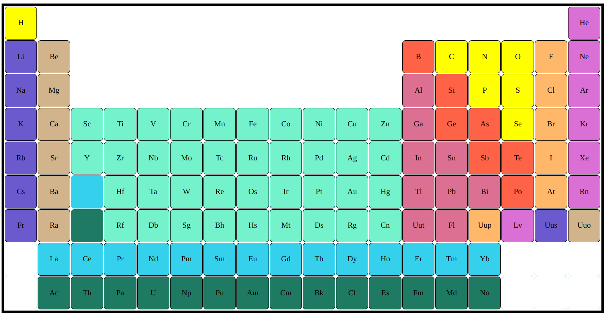
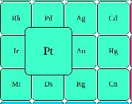

# Periodic table coloring using nth child

>*In this periodic table,  colored it using the CSS **Pseudo-class** n-th type.*
>
>
>
>*The list of nth type Pseudo-class used:*
>
| Pseudo-class   | Description |
| -------------- | ------------|
| :nth-of-type() | selects elements based on their position among siblings of the same type |
| :nth-child() | selects elements based on their position among a group of siblings |
| :nth-last-child() | selects elements based on their position among a group of siblings, counting from the end |
| :first-child | selects the first element among a group of sibling elements |
| :last-child  |selects the last element among a group of sibling elements |
| :nth-last-of-type() |selects elements based on their position among siblings of the same type (tag name), counting from the end. |
>
> *Features in this periodic table:*
>
> 1) **When a cell is hovered**, it is scaled 
>  * This is acheived using the transform scale property 
>
> 
>
>
> 2) *Used **Transition property** for smooth Transition between cells*
>
> 3) *Used **Border : none property** for empty cells*